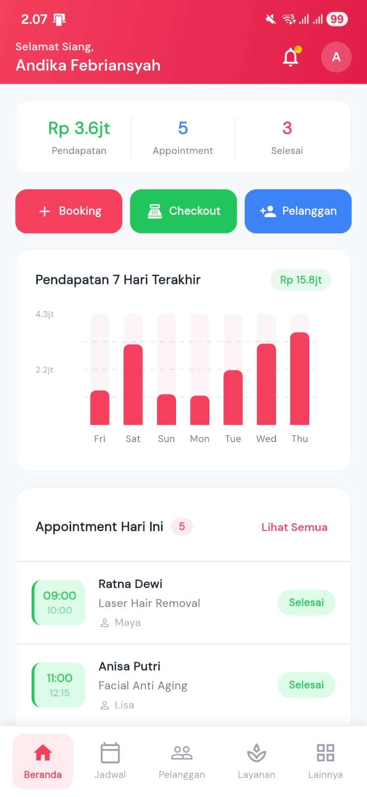
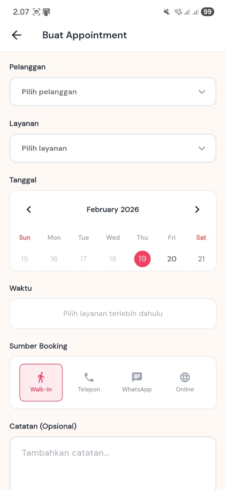
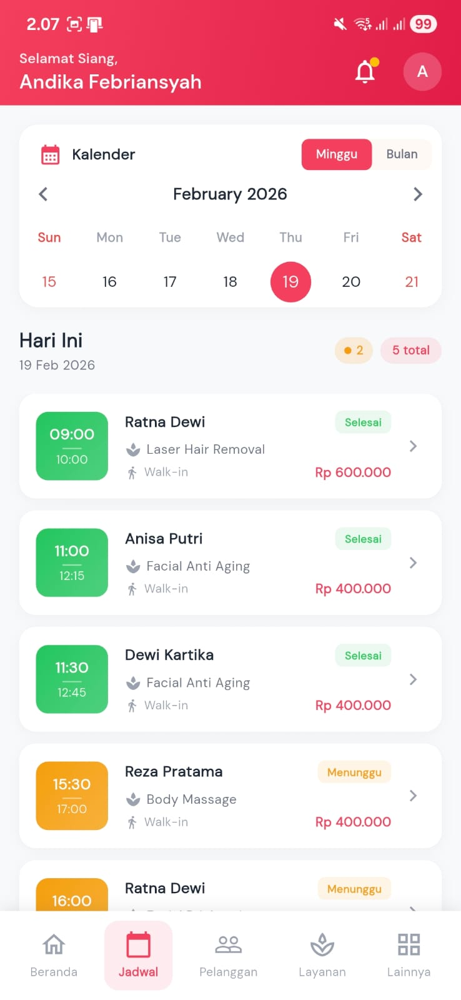
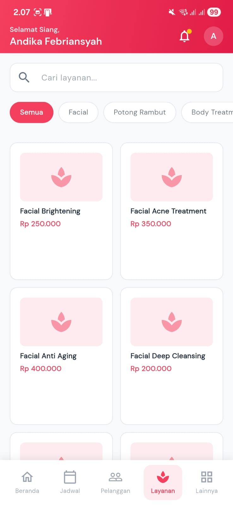

# GlowUp Clinic - Flutter Application

[](https://flutter.dev)
[](https://blog.cleancoder.com/uncle-bob/2012/08/13/the-clean-architecture.html)
[](https://bloclibrary.dev)

A modern, professional clinic management system built with Flutter. This application is designed to streamline operations for beauty clinics, providing a comprehensive suite of tools from appointment scheduling to point-of-sale (POS) and loyalty programs.

## 🚀 Features

### 📊 Dashboard & Analytics
*   **Real-time Stats:** Monitor daily revenue, appointments, and new customers.
*   **Revenue Charts:** Visual representation of earnings using `fl_chart`.
*   **Daily Agenda:** Quick view of today's scheduled appointments.

### 📅 Appointment Management
*   **Calendar View:** Manage bookings with a powerful calendar interface using `table_calendar`.
*   **Time Slot Booking:** Prevent overbooking with intelligent time slot management.
*   **Status Tracking:** Track appointments from "Pending" to "Completed" or "Cancelled".

### 👥 Customer Relationship Management (CRM)
*   **Detailed Profiles:** Store skin types, concerns, and visit history.
*   **Customer Loyalty:** Integrated points system and reward redemption.
*   **Referral Program:** Manage and track customer referrals.

### 💳 Point of Sale (POS) & Billing
*   **Smooth Checkout:** Handle services, products, and packages in one transaction.
*   **Multi-Payment Support:** Flexible payment options for customers.
*   **Invoice Printing:** Bluetooth thermal printer integration for instant receipts.

### 📦 Catalog Management
*   **Services:** Manage various clinic treatments and categories.
*   **Products:** Track retail product inventory and sales.
*   **Packages:** Bundle services into attractive packages for customers.

## 🛠 Tech Stack

*   **Core:** [Flutter](https://flutter.dev) (v3.10.1+)
*   **State Management:** [Flutter BLoC](https://pub.dev/packages/flutter_bloc)
*   **Dependency Injection:** [Get It](https://pub.dev/packages/get_it)
*   **Networking:** [HTTP](https://pub.dev/packages/http)
*   **Local Storage:** [Shared Preferences](https://pub.dev/packages/shared_preferences)
*   **Functional Programming:** [Dartz](https://pub.dev/packages/dartz) (Either for Error Handling)
*   **Utilities:**
    *   `print_bluetooth_thermal` & `esc_pos_utils_plus` for printing.
    *   `intl` for localization and currency formatting.
    *   `google_fonts` for typography.
    *   `cached_network_image` for efficient image loading.

## 🏗 Architecture

The project follows **Clean Architecture** principles to ensure maintainability, scalability, and testability:

1.  **Core:** Shared utilities, constants, themes, and reusable components.
2.  **Data:** Models (Request/Response), Data Sources (Remote/Local), and API services.
3.  **Presentation:** UI Layer consisting of Pages, BLoCs, and Widgets.

For more details, see [ARCHITECTURE.md](docs/ARCHITECTURE.md).

## 📥 Getting Started

### Prerequisites
*   Flutter SDK installed.
*   Android Studio / VS Code with Flutter extension.
*   A physical device or emulator.

### Installation
1.  Clone the repository:
    ```bash
    git clone https://github.com/yourusername/flutter_glowup_app.git
    ```
2.  Install dependencies:
    ```bash
    flutter pub get
    ```
3.  Run the application:
    ```bash
    flutter run
    ```

## 📸 Screenshots

<p align="center">
  
  
</p>
<p align="center">
  
  
</p>

## 📄 License
This project is for private use only. See `pubspec.yaml` for more information.

---
Built with ❤️ by the GlowUp Team.
